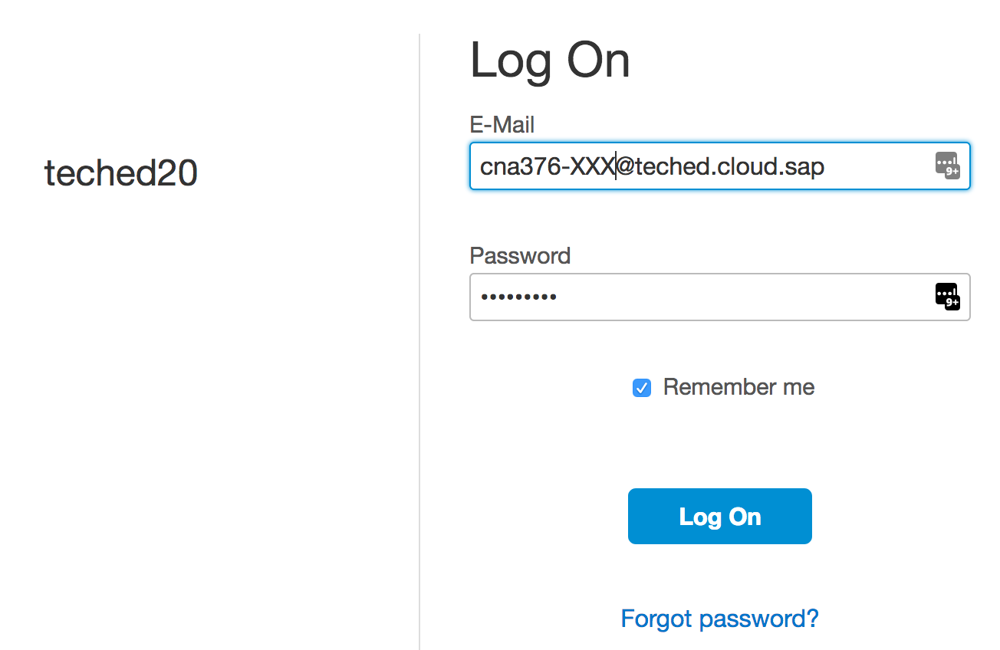
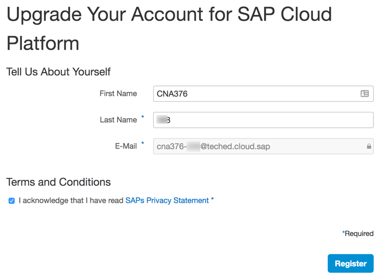
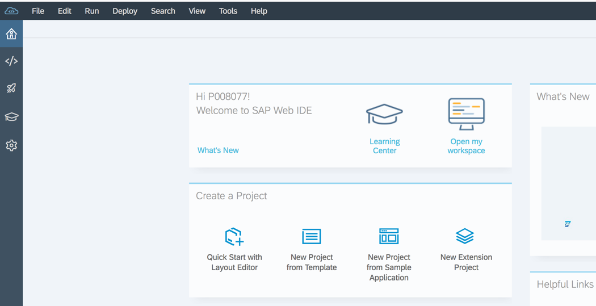
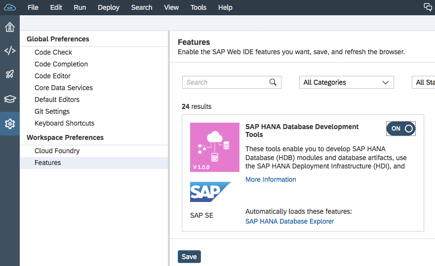
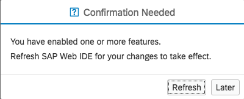
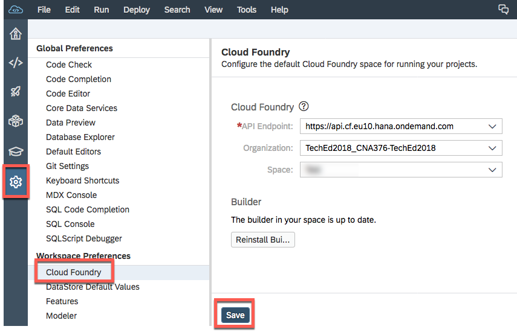
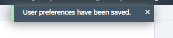
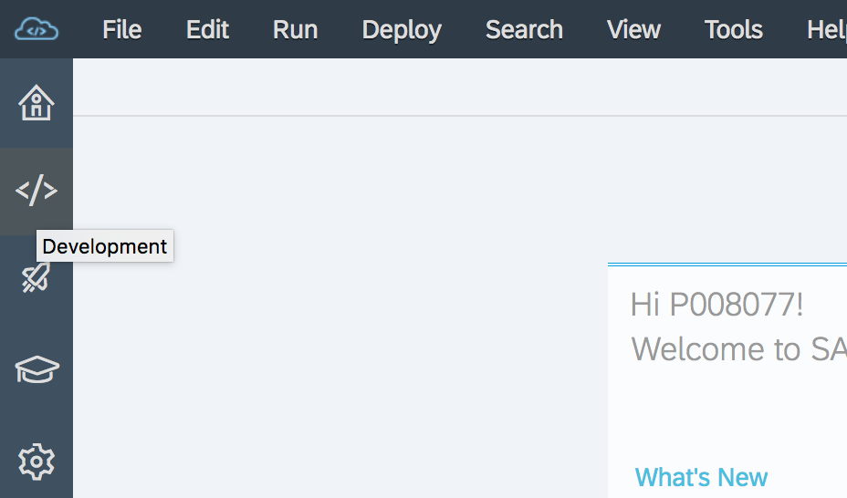

# Exercise 01: Access the SAP Cloud Platform account and clone sample code

## Estimated time

10 minutes

## Objective

In this exercise you will learn how to clone the Git repository that contains the sample project of this tutorial into the Web IDE of the SAP Cloud Platform.

## Exercise description

### 1. Log on to Web IDE

1. In a first step you need to access the Web IDE of your account. For the hands-on session **CNA376** at SAP TechEd 2018 use the link provided to you by the session instructors along with the corresponding credentials.

 

2. In case you are asked to upgrade your account, set the tick at the field `I acknowledge...` and provide your First Name (e.g. CNA376) and your Last Name "xxx".

 

3. The Web IDE opens up and shows your workspace. The workspace is empty if you use it for the first time.

 

### 2. Setup workspace settings

1. Click on the preferences icon on the left and select `Features`. Next, switch `ON` the `SAP HANA Database Devlopment Tools`. Finally click on the `Save` button at the bottom to enable the tools in your workspace.

   
 

   In the pop-up click on **Refresh**, so that the Web IDE can be re-started with the new settings.

   
 

3. In a final step click on `Cloud Foundry` in the `Workspace Preferences` In the field for the `API endpoint` select the first item `https://api.cf.eu10.hana.ondemand.com`.  The values for `Organization` and `Space` will be set automatically to `TechEd2018_CNA376-TechEd2018` and the space your user is assigned to.  Click on the `Save` button.

   Do NOT click the `Reinstall Builder` button.

   
 

   
 

### 3. Clone the code

1. Switch to the `Development` view in your workspace.
   
 

2. Now, right click on the Workspace text in the Web IDE and select `Git > Clone Repository `

   
 

3. In the URL field enter the URL `https://github.com/SAP/cloud-sample-spaceflight-java` and click on the `Clone` button.
   
 

4. After a short while, you will see the code that was cloned into your Web IDE workspace.

   
 

   > This workspace has now a local copy of the cloned code in the Web IDE.  In the next exercise we will take a look into this project.
