# Exercise 02: Understand the data model and deploy app to SAP Cloud Platform

## Estimated time

25 minutes

## Objective

In this exercise you will have a look into the data model of the application and you will deploy it to your SAP Cloud Platform account.

## Exercise description

### 1. Build the data model and deploy it to SAP HANA

1. Click on the folder `db` of your project and from the context menu select `Build` > `Build`.

   
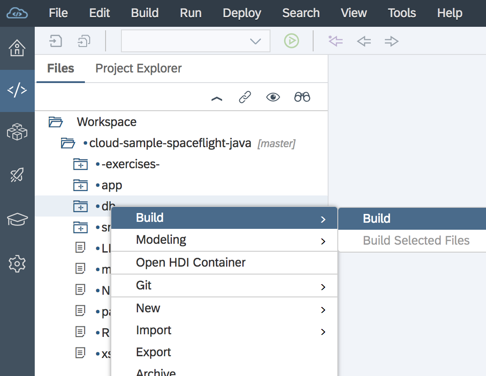 

   > During this step the data model is transformed into the respective `hdbcds` artifacts, which are then deployed to an HDI Container.  In Web IDE's console view you can watch the progress of the deployment operation.

2. Open the `db` folder, double-click on the file `flight-model.cds` and have a look into the definition of the data model.
   
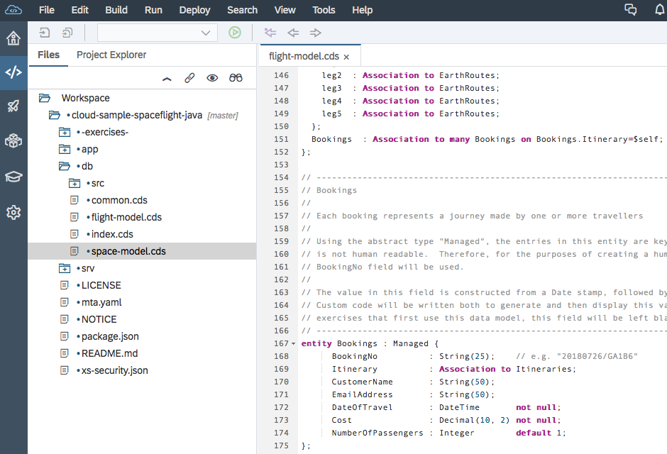 

   > Tip: To help you find files easier in the tree, enable the `Link Workspace to Editor` setting.  Everytime you switch to another editor, this will select the file in the file tree.
       
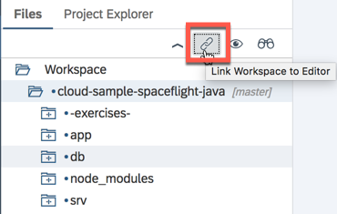 

3. Once the HANA artifacts are created, you should see a success message in the console view at the bottom.

   
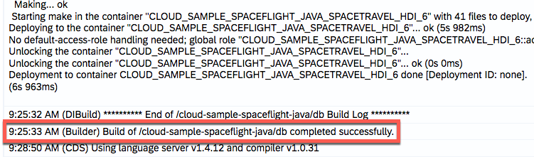 

4. Let's take a look into what was deployed. Right-click again on the `db` folder and select `Open HDI container`.  This will open up the SAP HANA database explorer.

   
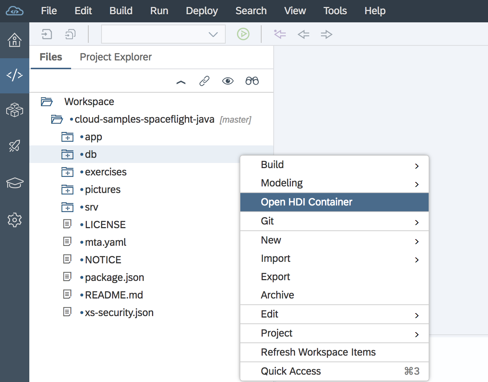 

   In case you are asked whether to add any database, simply click `No`, as the database connection will be added automatically.

   
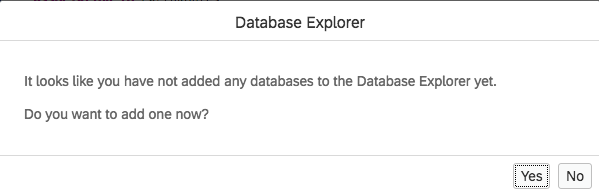 

5. Click on the `Tables` icon on the left, select table `TECHED_FLIGHT_TRIP_BOOKINGS`, which opens the table editor.

   
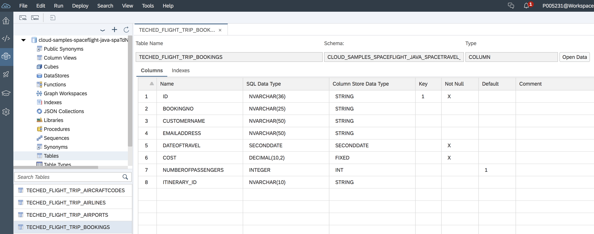 

6. If you want to see the table data, click on the `Open Data` button on the top right.

   
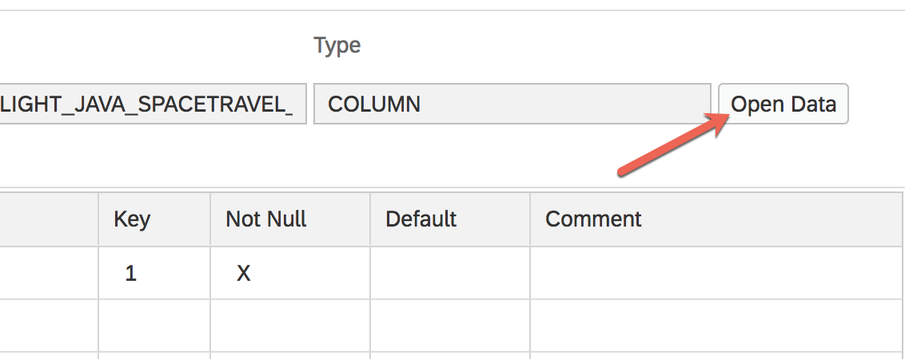 

   
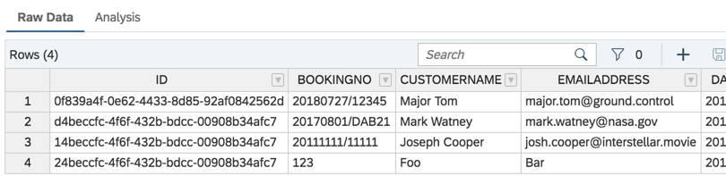 

   > The data you see here is maintained in the resource folder `db > src > csv` and was deployed along with the table definitions.
       
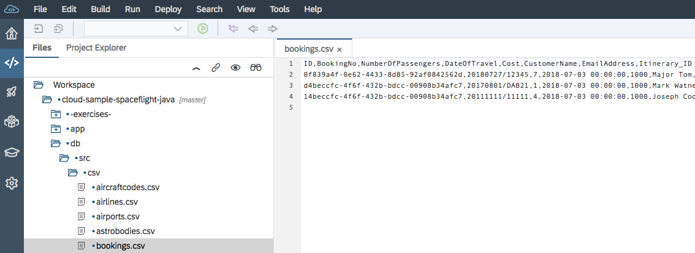 

### 2. Run the OData service

1. Go back to the `Development` perspective of your workspace and select the `srv` folder of your project.  Click on the green **Run** icon in the main toolbar to run the app.

   
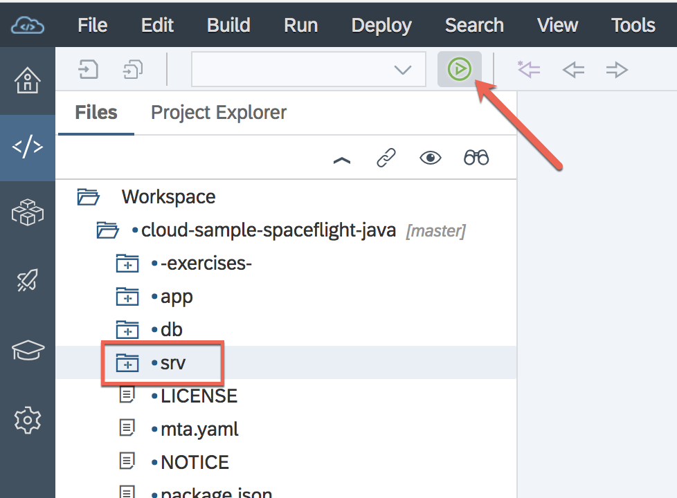 

   In the console you can watch how the service is being build any deployed. Once it is ready, a link is provided. Click on that link to open the URL of the OData endpoints.

   
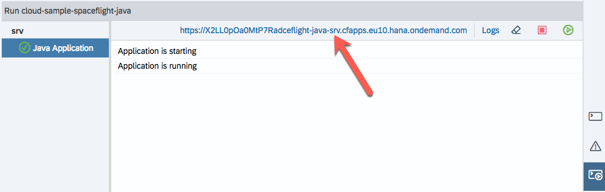 

2. The OData endpoints are displayed. Click on the link for the `BookingService`.

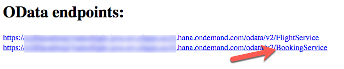 

3. You can now see the entities of the booking service

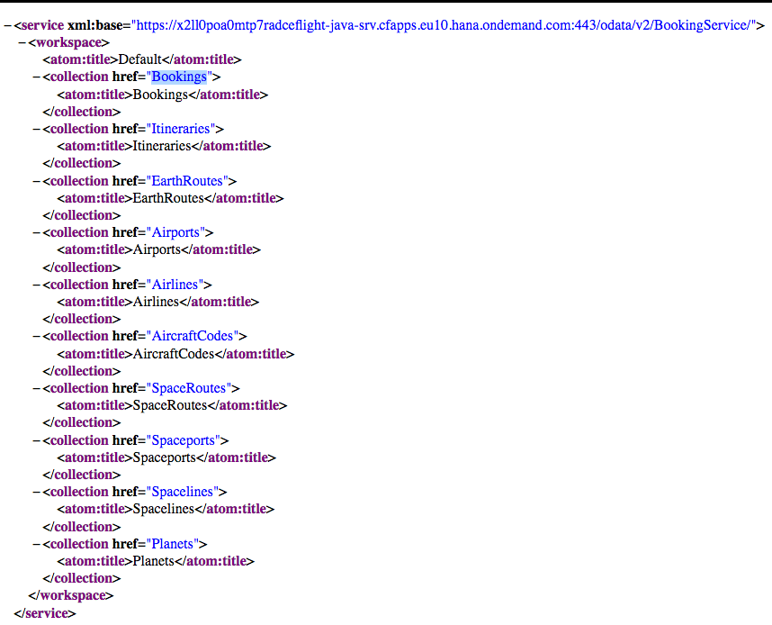 

> So far the database and the service layer are running. In the next step we will deploy the UI.

### 3. Run the app module

1. Click on the `app` folder of your project. Click again on the **play** icon under the menu to build the UI of the application.

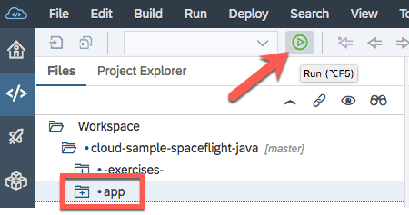 

2. Select the file `flpSandbox.html` and click on the `OK` button.

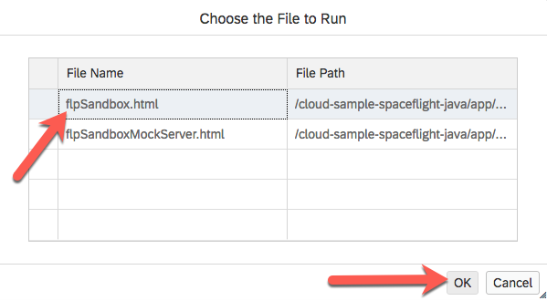 

3. If you get this pop-up provide your email address the account password.

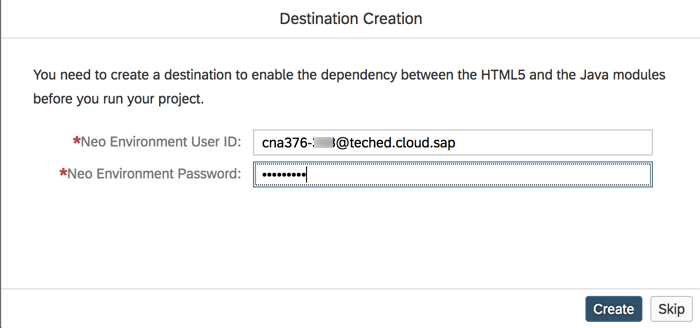 

4. Once the app is created it will open-up automatically. Click on the tile `app`

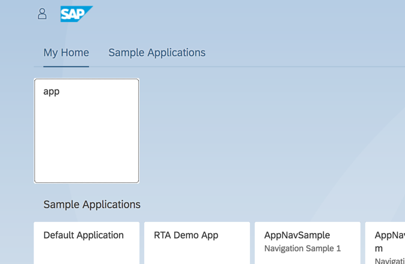 

5. Click on the `Go` button to fetch the data from the database.

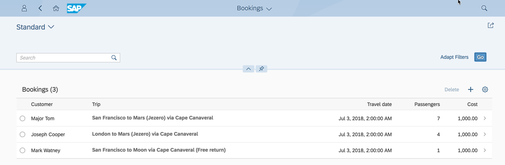 

6. You can get to the details for each booking, by clicking on one of them.

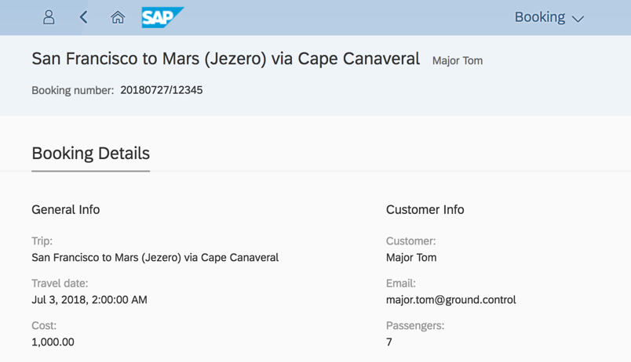 

