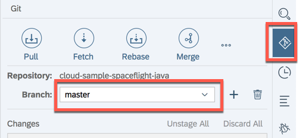
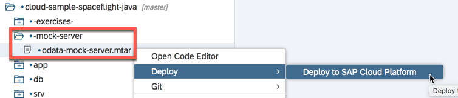
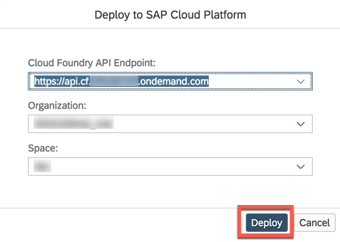
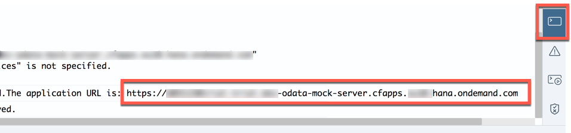
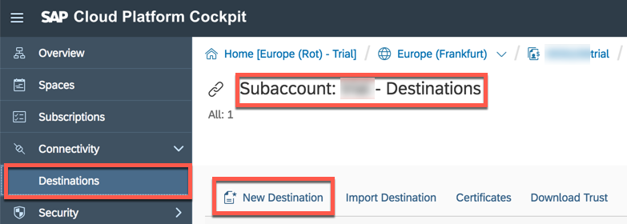
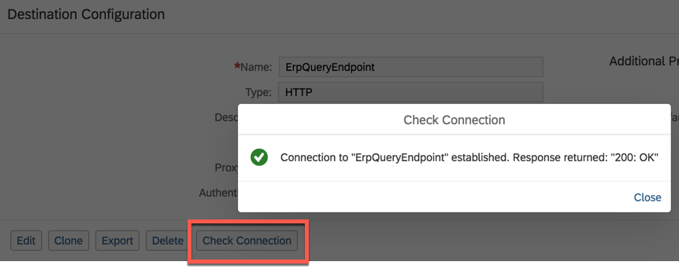

# Mocking OData APIs of SAP S/4HANA

The mock server provided by SAP S/4HANA Cloud SDK can be used to test the OData integration capabilities without access to an SAP S/4HANA system.  The server hosts an OData v2 mock service that mimicks the business partner API of SAP S/4HANA Cloud to a limited extent.

> Find more information on the [mock server](https://github.com/SAP/cloud-s4-sdk-book/tree/mock-server).

## Setup

1. In the Web IDE Git pane select the **master** branch:
   
 

2. Deploy the MTA archive

   - For your convenience, there is a prebuilt MTA archive for the mock server that can be easily deployed from Web IDE.
     Find the `.mtar` file below `-mock-server-`, right-click on it, and execute `Deploy to SAP Cloud Platform`.
     
 

   - Enter the credentials for SAP Cloud Platform:
     
 

   - In Web IDE's console view, wait for the deployment to finish.  From the end of the output in the console, copy the application URL to your clipboard.
     
 

3. Create a destination in Cloud Cockpit

   - In Cloud Cockpit, go to Cloud Foundry environment and then to the subaccount your application will be deployed to.  There, open the _Destinations_ page.
     
 

     > In order to access the _Destinations_ item on the subaccount, make sure to be global account member or security administrator.  Otherwise you might need to ask your account administrator to create the destination for you.
     Find out more about [destination management](https://help.sap.com/viewer/cca91383641e40ffbe03bdc78f00f681/Cloud/en-US/82ca377549c5421a8199013ea5f0facc.html) on SAP Cloud Foundry.

   - Click on `New Destination`.  As destination name, enter `ErpQueryEndpoint`.  As URL, paste the application URL from your clipboard.
     
 

     > `ErpQueryEndpoint` is used as default destination name by S/4HANA Cloud SDK.  See the [SDK documentation](https://blogs.sap.com/2018/01/19/deep-dive-7-with-sap-s4hana-cloud-sdk-s4hana-connectivity-made-simple/) for more information.

   - After having saved the destination, click on _Check Connection_ to verify the server responds with return code `200 OK`.
     
 

     > If you get an error, make sure you haved entered the proper URL.  Open it in a browser window to verify the application is up and running.

## Next
From here on, the application uses the server as if it would be a live SAP S/4HANA system.

Continue with the [exercise](../README.md).
