# Exercise 03: Connect to the S/4HANA business partner service

## Estimated time

25 minutes

## Objective

In this exercise you will learn how to add a remote service to your app that fetches customer data from an S/4HANA system. When creating a new booking, this data will be fetched once and then cached in your application database.

## Exercise description

### 1. Switch to a different start branch

For this exercise you have to **switch to another code branch** of the Git repository.
In the Git pane click the `+` icon:

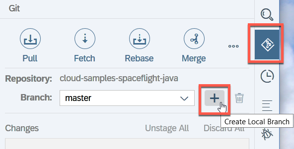 

As source branch select `origin/s4bp-start`.  The name of the local branch is suggested automatically.  Click `Ok`.

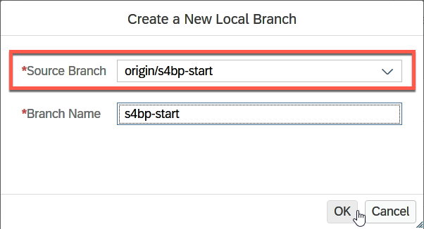 

The file explorer always shows the currently active branch:

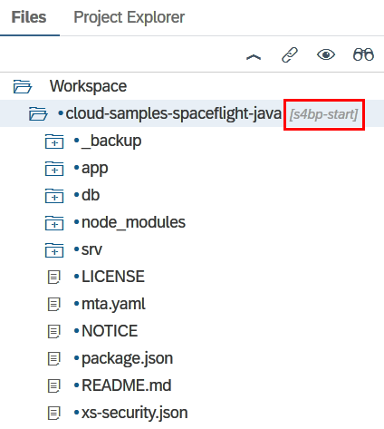 

### 2. Import S/4HANA service

<!-- 1. **Download the model of the external service from SAP API Business Hub**

   Navigate to SAP API Business Hub by opening the URL https://api.sap.com in a separate browser tab.  Select the `Log On` button and enter the email address and password of your user.
   
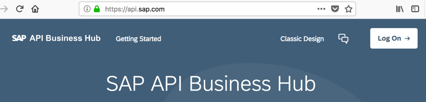 

   In the search field type "OData Service for Business Partner" and press the search icon.
   
 

   On the next screen switch to the "Details" view. Scroll down to select "Download Specification" and then select "EDMX".  Store this file to your local machine.
   
 
 -->

1. **Activate SAP Business API Hub for your user**

   Navigate to SAP API Business Hub by opening the URL https://api.sap.com in a separate browser tab. Select the `Log On` button and enter the email address and password of your user.
   
 

   If this is the first logon with this user, you need to accept the terms of use for SAP API Business hub.  Select the two checkboxes and confirm.
   
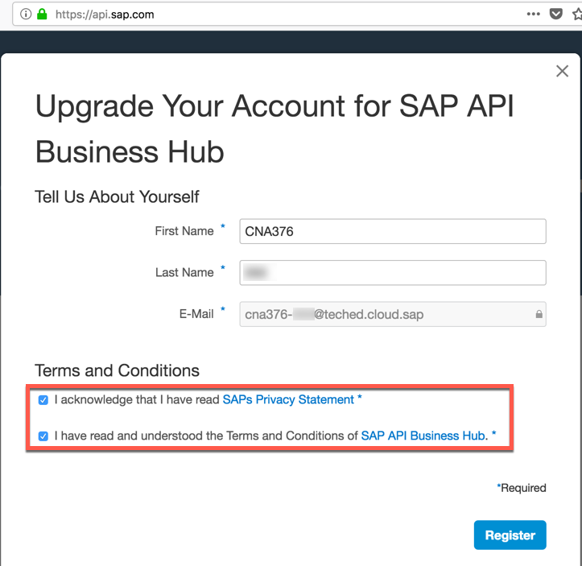 

   If you don't get to see this screen, this was already done for this user.

2. **Download the model of the external service from SAP API Business Hub**

   In the search field type "OData Service for Business Partner" and press the search icon.
   
 

   On the next screen switch to the "Details" view. Scroll down to select "Download Specification" and then select "EDMX".  Store this file to your local machine.
   
 

3. **Import the service model into your project**

   a. Switch back to SAP Web IDE and on the `srv` folder select `New` > `Data Model from External Service` from the context menu:
   
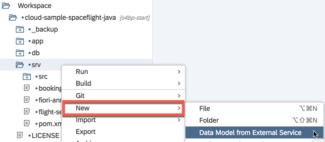 

   b. In the wizard, select `File System` and `Browse` and find the downloaded model file on your computer.  Press `Next`.
   
 

   c. Deselect the checkbox `Generate Virtual Data Model classes` and press `Finish`.
   
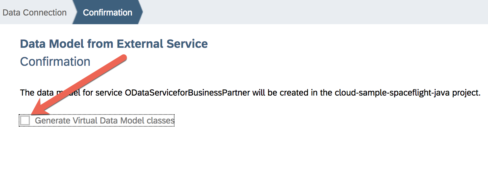 

   > Java class generation for the data model is not needed in our case, as we will be using precompiled and optimized classes provided by S/4HANA cloud SDK.

   d. Verify in file explorer that the import has generated two service definitions, one in `xml` format, the other in `json` format   These can be found in folder `srv` > `external`.
   
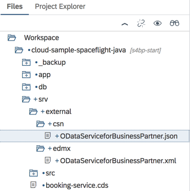 

   > While the `xml` file, the so-called `edmx`, is the original model file from API Business Hub, the `json` file is the compiled representation of the model for CDS.  It is this `json` file, so-called `cson`, that we will reference from other `cds` source files.

<!-- 3. **Import the service model into your project**

   a. Switch back to SAP Web IDE and on the `srv` folder select `New` > `Data Model from External Service` from the context menu:
   
 

   b. In the wizard, select `Browse` and find the downloaded model file.  Press `Next`.
   
 

   c. Deselect the checkbox `Generate Virtual Data Model classes` and press `Finish`.
   
 

   > Java class generation for the data model is not needed in our case, as we will be using precompiled and optimized classes provided by S/4HANA cloud SDK.

   d. Verify in file explorer that the import has generated two service definitions, one in `xml` format, the other in `json` format   These can be found in folder `srv` > `external`.
   
 

   > While the `xml` file, the so-called `edmx`, is the original model file from API Business Hub, the `json` file is the compiled representation of the model for CDS.  It is this `json` file, so-called `cson`, that we will reference from other `cds` source files. -->

### 3. Use external model in flight data and service model

1. **Update CDS**

   After the import we need to make the CDS build system aware of the new model.  On the project node in the tree, select `Build CDS` from the context menu.
   
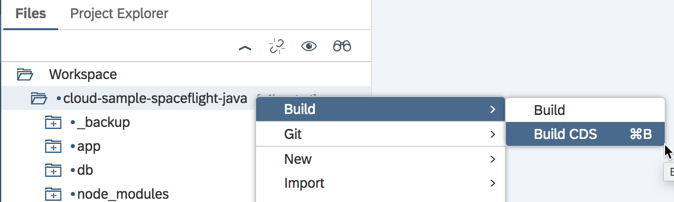 

   > In future versions of Web IDE this step will no longer be necessary.

2. **Remove comments in file `db/index.cds`**

   Remove the comment markers from all lines.  After selecting all lines, you can use the `Toggle Line Comment` command from the editor context menu, or hit `Ctrl+/`

   **Note**: After you save the file, CDS auto build will yield errors for the project.  No worries, we will fix them in the next step.  The file should look like this:
   
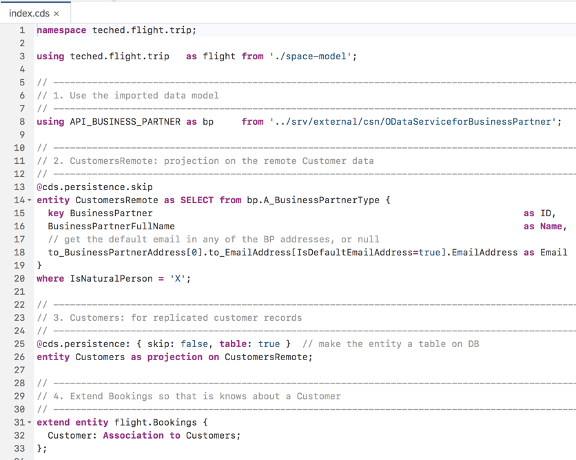 

   > That seems like a lot of code.  Let's break it down:
   > 1. In the `using` clause in line `8` the imported model is made available under the `bp` alias.  The string after the `from` keyword is a relative path to the model file.
   > 2. `CustomersRemote` entity from line `14` is basically a view on the imported business partner type.
   >    - From the wide range of available business partner fields, it only selects three of them, and adds convenient name aliases `ID`, `Name`, and `Email`.
   >    - Note how the `Email` field is selected by following two associations in line `18`.
   >    - In line `20` the `where` clause further filters records by just selecting natural persons.
   >    - We will use this `CustomersRemote` table/entity for value helps in the UI.
   > 3. `Customers` entity in line `26` builds on top of `CustomersRemote`.
   >    - However, it turns it into a real table through the `@cds.persistence.table` annotation from line `25`.
   >    - We will use this `Customers` table/entity to cache business partner records that we have retrieved from S/4HANA.  We not only do this for performance reasons, but also because we can conveniently join and query over both 'local' and 'remote' data sets.
   > 4. Finally, in line `31-33` the `Bookings` entity is extended by an association to the `Customers` table from above.  By storing the customer ID with each booking, we link `Bookings` with `Customers` records.

3. **Remove comments in file `srv/booking-service.cds`** in the last two lines.

   
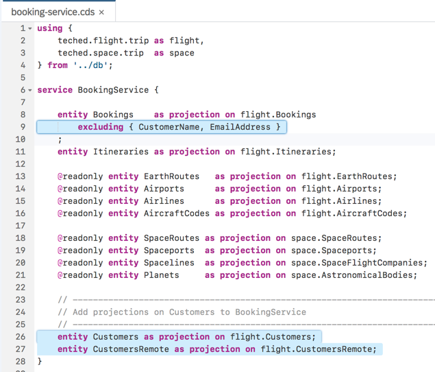 

   After you save the file, CDS auto build should now successfully compile our CDS model.
   Should there still be errors shown in `db/index.cds`, close the editors and refresh the browser page.

   > Much like the other `as projection on` lines, the two new lines expose the new `Customers` and `CustomersRemote` entities in the `BookingService`.

4. **Build and deploy to the database**

   The model is now ready to be compiled and deployed to SAP HANA.  Use the `Build` command on the `db` folder to do this.
   
 

   There should be a success message in console view for the deploy operation:
   
 

5. **Inspect the service**

   Navigate to URL `.../BookingService/$metadata`.  You will find two new entities `Customers` and `CustomersRemote`.  Also, `Bookings` got a new `Customer_ID` property.
   
 

   Using URL `.../BookingService/Bookings` you can see that our sample data (in the `db/src/csv` folder) already makes use of `Customer_ID` and stores the link to a (artificial) customer number `1` in the booking.
   
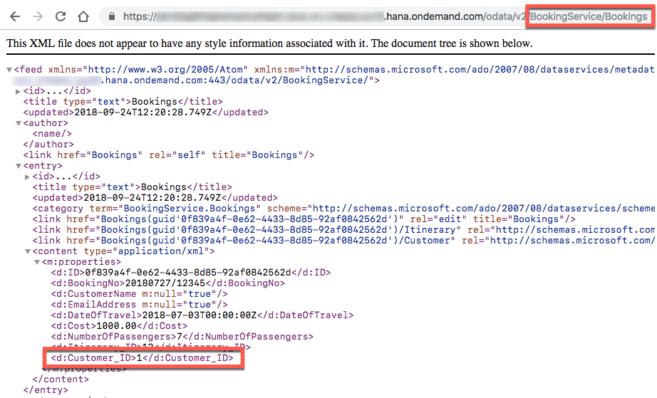 

<!-- 5. **Browse the database**

   On the `db` folder, select `Open HDI Container`, which will lead you to the deployed tables.
   Click on the `Tables` item in the tree.
   
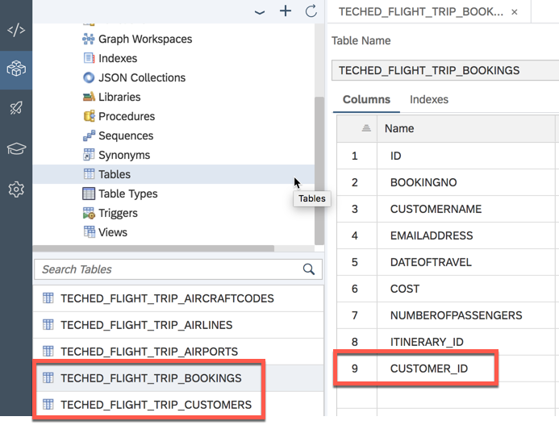 

   > Note that there is a new table `..._CUSTOMERS` for the `Customers` entity.  Also, in table `..._BOOKINGS` you can see a new column `CUSTOMER_ID` holding the foreign key to the `CUSTOMERS` table.  In the next section you will see how this new table is filled with data from S/4HANA. -->

### 4. Call S/4 in the Java code

1. **Change `CustomersRemoteHandler.java`**:

   To enable reading a single customer record, add a comment in line `31` and remove the comment from line `32`:
   
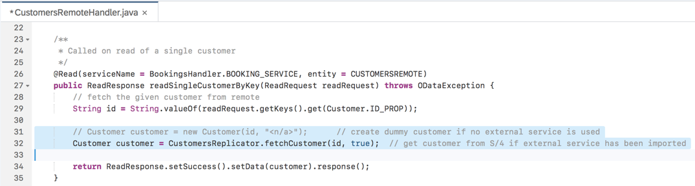 

   To enable reading multiple customer records, add a comment in line `47` and remove the comment from line `48`:
   
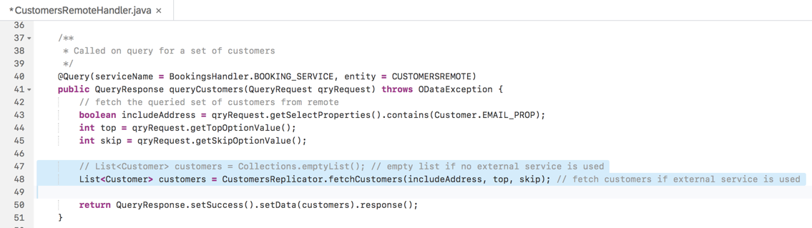 

   > If you are curious, you can take a look into the `CustomersReplicator` class to see how we call the business partner OData service using the S/4HANA Cloud SDK.

2. **Verify the code works**

   a. Run the Java application:
   
 

   b. Click the URL of the Java application in the run console:
   
 

   c. Select the BookingService endpoint:
   
 

   d. Check the data retreived as `Bookings` and as `CustomerRemote`:
   
 

   
 

   > Whenever we get or query the `CustomersRemote` entity, a new remote call is made. In the next section we will cache the retrieved customer records.

### 5. Prepare storing S/4 customers in the local database

1. **Adjust `BookingsHandler.java`**

   Remove the line comments in line `75`:
   
 

   Also remove the comments from method `fetchAndSaveCustomer`:
   
 

   Save the file.

   > Now, for each new booking created, the respective customer record is going to fetched and saved to the local database.
   To create a booking, we need a UI, though.  Let's do this real quick in the next section.

2. **Run again the service again**

   
 

### 6. Create bookings for S/4 customers

1. **Adjust the UI**

   The UI can be adapted when adding/changing Fiori annotations to CDS models. Remove the line comments for the section marked in the following figures:
   
 

   
 

   
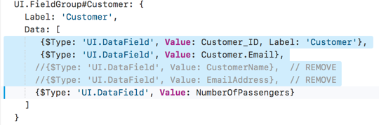 

   
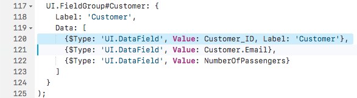 

2. **Run the UI within SAP Web IDE**

   
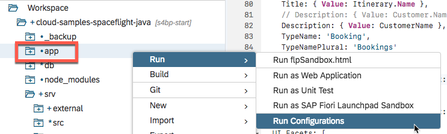 

   
 

   
 

3. **Create a new booking for an S/4 customer:**

   
 

4. **Check that this S/4 customer has been persisted (cached) in the database**

   
 

