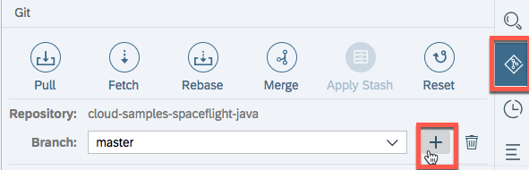
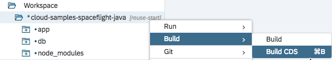
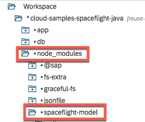
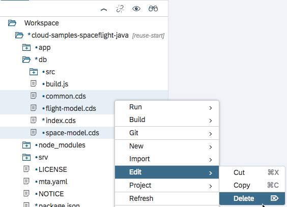
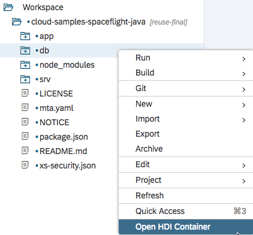
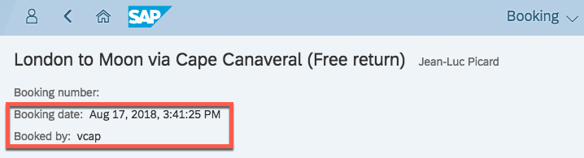

# Exercise 04: How to consume a reuse model in your app

## Estimated time

25 minutes

## Objective

In this exercise you'll learn how to reuse CDS model code from other applications.  Also you will see how our application benefits from generic runtime functionality for administrative fields, which are enabled through OData annotations.

# Exercise description

## 1. Preparation
1. For this exercise you have to switch to another code branch of the code you've cloned from Github. Click on the symbol on the right of the browser and click on `Pull` and after that on the `Fetch` symbol.

2. Checkout the `reuse-start` branch:

2. Once this has worked, you should see an information at the top right saying `Pull completed.` and `Fetch completed`

> You will find the final state of this exercise in branch `reuse-final`.

## 2. Add dependency to base model repo

1. Locate `package.json` at root level

2. Adjust `package.json` in the following two places

3. Let's see which files we get from the imported model

- Execute _Build CDS_ on the project

  

- Find `node_modules/spaceflight-model` and see the model files

  

4. Remove redundant model code

- Delete files `common.cds`, `flight-model.cds`, and `space-model.cds`.  These files are now used from the reuse model.
  

- Remove the first two lines of `index.cds`.  Comment in the last line.
  

- Comment in the first line of `srv/booking-service.cds`.  Remove the rest of the lines.
  

5. Deploy to database
  

6. Browse database
- Open database explorer:

  

- See that we got 4 more columns in the `BOOKINGS` table:

  
  These are admin data from `node_modules/@sap/cds/common.cds`, which we inherit through `node_modules/spaceflight-model/db/common.cds`.

- Restart application
  

- Let's create a booking...
  

  ... and display it aftwards.
  

  _Booking date_ and _Booked by_ have been filled automatically.  This is possible since the underlying fields `Bookings.createdAt` and `Bookings.createdBy` are annotated such that the generic OData handlers know how to fill them (see `node_modules/@sap/cds/common.cds` for the annotations).
  > Normally with authentication enabled, the proper login user would be set for the `createdBy` field.  Without authentication, however, we just see Cloud Foundry's generic `vcap` user.
