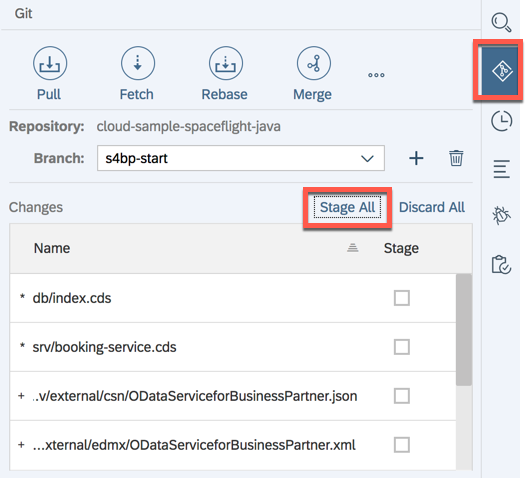
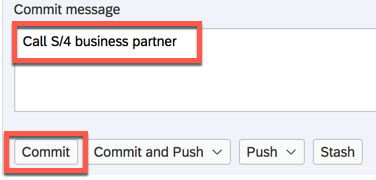
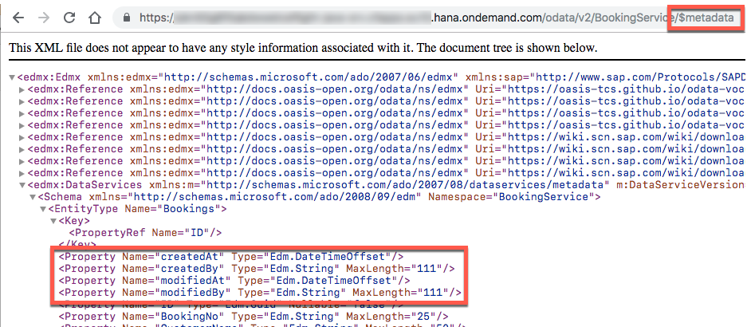
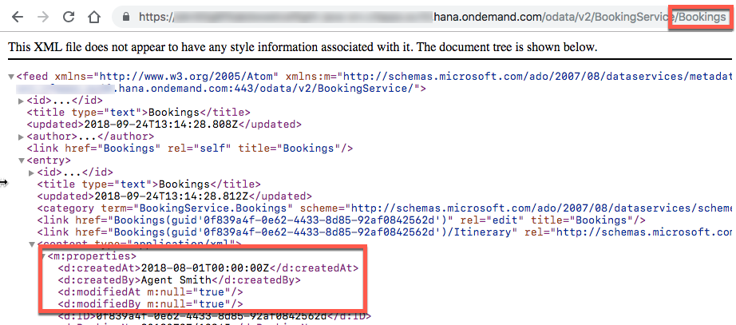

# Exercise 04: How to consume a reuse model in your app

## Estimated time

25 minutes

## Objective

In this exercise you'll learn how to reuse CDS model code from other applications.  Also you will see how our application benefits from generic runtime functionality for administrative fields, which are enabled through OData annotations.

# Exercise description

## 1. Preparation
For this exercise you have to switch to branch `reuse-start` of the Git repository.

1.1. First, save any work from the previous exercise by committing the changed files in the Git pane.

- Stage all files:
  <p align="center"> </p>
- Then add a commit message and select `Commit`:
   <p align="center"> </p>

   > `Commit` is a local operation in Git, while `Push` would also modify them on the  remote Github repository.  In this exercise we stay with `Commit`.

1.2. Create a local branch called `reuse-start`.  Make sure to select `origin/reuse-start` as source branch.
   <p align="center"> </p>
   <p align="center"> </p>

> You will find the final state of this exercise in branch `reuse-final`, should you wish to skip the exercise.


## 2. Add dependency to base model repo

2.1. Locate `package.json` at root level

   <p align="center"> </p>

2.2. Add the following snippets to `package.json`.
   - To the `dependencies` block:
      ```json
      "spaceflight-model": "https://github.com/SAP/cloud-sample-spaceflight"
      ```
   - To the `scripts` block:
      ```json
      "build": "cds build --clean && reuseTableData"
      ```
   The file should now look like this:
   <p align="center"> </p>

   **Check out for JSON syntax errors** in the editor, in case you missed adding a comma.

2.3. Let's see which files we get from the imported model

- Execute _Build CDS_ on the project
  <p align="center"> </p>

- Expand `node_modules` folder and see that we got a folder `spaceflight-model` with the imported model files:
  <p align="center"> </p>

  > All files below `node_modules` are overwritten by the CDS build and not meant to be modified.

2.4. Remove redundant model code

- Collapse `node_modules` folder again to avoid mixing files up with the genuine source files in the application.

- Delete files `common.cds`, `flight-model.cds`, and `space-model.cds`.  These files are now used from the reuse model.
  <p align="center"> </p>

- Remove the first two lines of `index.cds`.  Comment in the last line.
  <p align="center"> </p>

- Comment in the first line of `srv/booking-service.cds`.  Remove the rest of the lines.
<p align="center"> </p>


2.5. Deploy to database

   As usual, use the `Build` menu on the `db` folder.
   <p align="center"> </p>

2.7. Browse the database

- Open database explorer:
  <p align="center"> </p>

- See that we got 4 more columns in the `BOOKINGS` table:

  <p align="center"> </p>

  These are admin data from `node_modules/@sap/cds/common.cds`, which we inherit through `node_modules/spaceflight-model/db/common.cds`.

2.6. Restart the Java application

   As usual, hit `Run` on the `srv` folder.
   <p align="center"> </p>

   Browse to URL `.../BookingService/$metadata`.  We got 4 more properties in the `Bookings` entity.
   These are admin data from `node_modules/@sap/cds/common.cds`, which we inherit through `node_modules/spaceflight-model/db/common.cds`.
   <p align="center"> </p>

   Using the `.../BookingService/Bookings` URL we see the corresponding data that was filled by the `db/src/gen/bookings.csv` file.
   <p align="center"> </p>

2.7. Check the changed model in the UI

   Restart the UI application as usual:
   <p align="center"> </p>

   Now create a booking:
   <p align="center"> </p>

   ... and display it.
   <p align="center"> </p>

   _Booking date_ and _Booked by_ have been filled automatically.  This is possible since the underlying fields `Bookings.createdAt` and `Bookings.createdBy` are annotated such that the generic OData handlers know how to fill them (see `node_modules/@sap/cds/common.cds` for the annotations).

   > Normally with authentication enabled, the proper login user would be set for the `createdBy` field.  Without authentication, however, we just see Cloud Foundry's generic `vcap` user.
