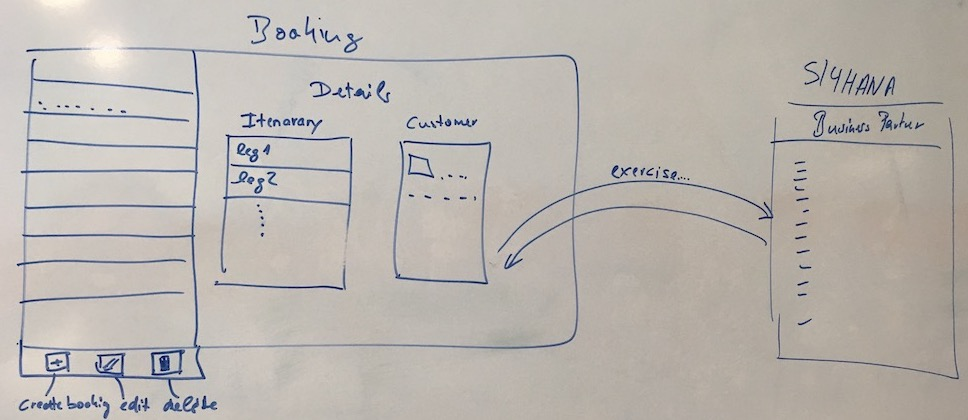
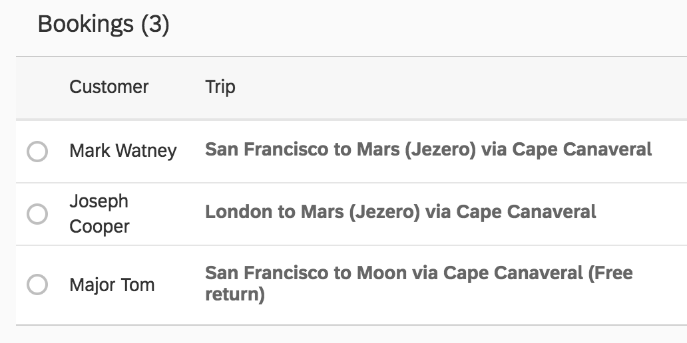

# Scenario
You are working in the IT department of the space travel agency SPICY (SPace Itenaries CompanY) and are asked by management to develop the best-of-breed enterprise-grade booking app.
Timeline is tight and the legal requirements of 20 planets need to be considered.  You start with the SAP Cloud Platform that will bring you where no app developer has gone before.

## Bookings UI
### Concept

### List of bookings

### Detail screen

## Preview
Deployed on [https://cdsteched2018-cna376-spacetravel-app.cfapps.sap.hana.ondemand.com](https://cdsteched2018-cna376-spacetravel-app.cfapps.sap.hana.ondemand.com/app/test/flpSandbox.html#Bookings-display).

Administer via [cdsteched2018/cna376](https://account.int.sap.hana.ondemand.com/cockpit#/globalaccount/6a8e3c4e-77ea-482c-b37b-4ce687a8bfe0/subaccount/c64e888a-20be-4bec-a15e-58e81ab4e857/org/4ac89a3b-e56e-4c48-81e1-e6d6008d0751/space/68c15de5-b940-48f3-819e-3f1d89e58ac2/).

# [TEAM TO DO]

- [ ] Organize S/4HANA system for all participants or setup mock server for Business Partner service if S/4HANA not available
	- [Demo Landscape](https://jam4.sapjam.com/groups/UyIlwc82Pn5KAvJSamK7CW/overview_page/jKX5WXNdMMqSphsl5RFOFN).  See [sample Business Partner query](https://my300448.s4hana.ondemand.com/sap/opu/odata/sap/API_BUSINESS_PARTNER/A_BusinessPartner?$top=10) on EAY.
	- [VLAB Systems](https://wiki.wdf.sap.corp/wiki/display/S4CDPublic/Access+to+VLAB+systems)
	- [Mock server for Business Partner](https://github.com/SAP/cloud-s4-sdk-book/tree/mock-server)
- [ ] Create storyboard for agengy booker (Rui + Christian)
- [ ] Organize Global account for hands-on session (Rui). We need:
	- HANA DB (64 GB or 128 GB)
	- One CF Subaccount per TechEd location
	- One Neo Subaccount (for creating re-use code)
	- Quota per session participants (max. 50 participants for 2 sessions each)
  		- 2 app instances (1GB per instance)
  		- 1 route
  		- 1 service
## [DECISIONs]
All exercises running on Web IDE!!

# Exercises

## Exercise 01: Access SAP Cloud Platform account and clone code to Web IDE (10 minutes)
Audit logging? GDPR compliance??

## Exercise 02: Understand the data model and deplopy app to SAP Cloud Platform (15 minutes)

## Exercise 03: Connect an S/4HANA business service (business partner) (20 - 25 minutes)

## Exercise 04: Build your own reusable Business Service and consume it in your app (20 minutes)
flight model vs space model?

Check https://api.sap.com/api/API_BUSINESS_PARTNER for business partner

Destinations ....

Stay tuned... Caching coming soon...

## Exercise 05: Adjust UI to show business partner (15 minutes)

## Exersice 07: Bonus 1 - Authentication & Authorization

## Exercise 08: Bonus 2 - Audit Logging
