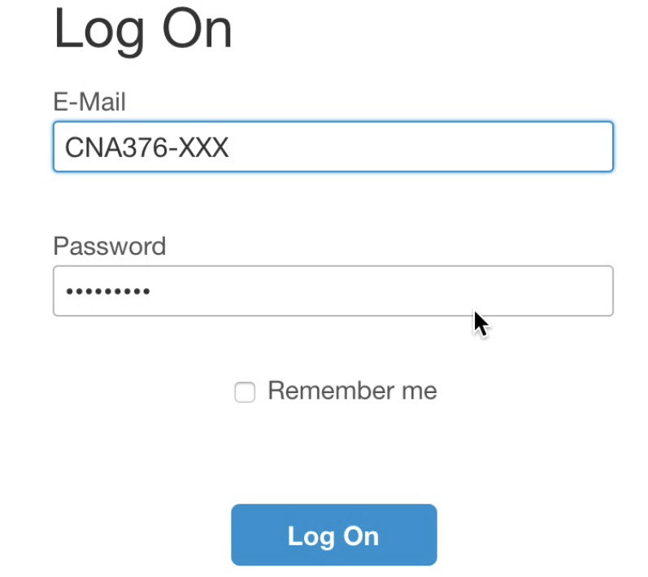
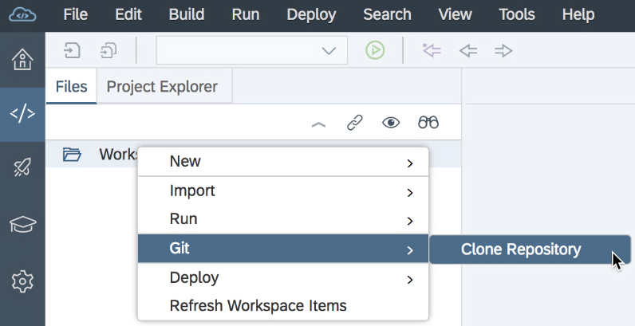

# Exercise 01: Accessing the SAP Cloud Platform Account and Cloning Sample From Github

## Estimated time

10 minutes

## Objective

In this exercise you'll learn how to clone the Git repository that contains the sample project of this tutorial into the WebIDE of the SAP Cloud Platform

 Exercise description

## 1. Access the WebIDE

1. In a first step you need to access the WebIDE. Therefore click on [this link](https://webide.sap.com/xxx) and log on with the credentials provided to you by the instructors of the SAP TechEd 2018 session CNA376.

2. The WebIDE should open up and shows your workspace. The workspace should be empty.

3. Next thing to do is to right click on the Workspace text in the WebIDE and select `Git > Clone Repository `

4. In the URL field please enter the URL `http://github.com/SAP/cloud-samples-spaceflight-java` and click on the `Clone` button.

5. You should see now the code that was cloned into your WebIDE workspace. This workspace has now a local copy of the cloned code in the WebIDE.

6. Finally you can click on the project `cloud-samples-spaceflight-java` and look into the pre-filled folders.

7. Congratulations! We can now jump to the next exercise.