# Exercise 03: Connect an S/4HANA service (business partner)

## Estimated time

25 minutes

## Objective

In this exercise you'll learn how to add a remote service to your app which fetches customer data from an S/4 system. This data will be read once and then cached in your application database.

# Exercise description

## 1. Import S/4 HANA service

1. For this exercise you have to switch to another code branch of the cloned Github repository. In the Git pane, click the '+' icon to create a new local and link it to the desired remote branch. 

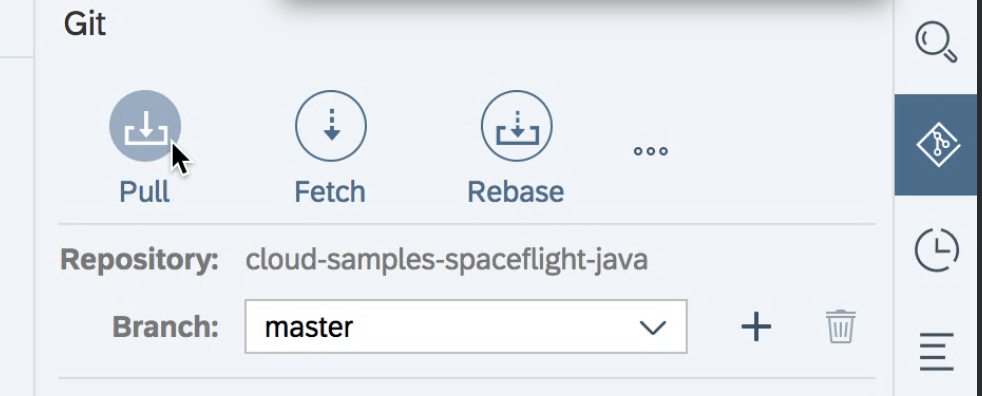

Select the branch names as shown in the picture:

Click on the symbol on the right of the browser and click on `Pull` and after that on the `Fetch` symbol.

2. Once this has worked, you should see an information at the top right saying `Pull completed.` and `Fetch completed`
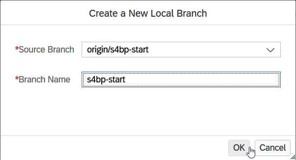

3. Not sure what we have done here before TBD TBD TBD

4. xxxx
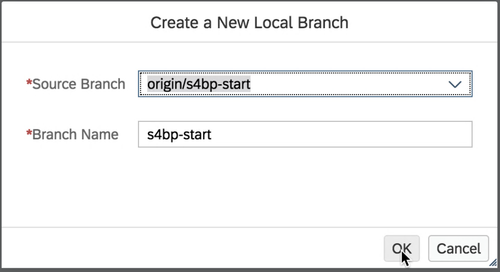

5. xxxx
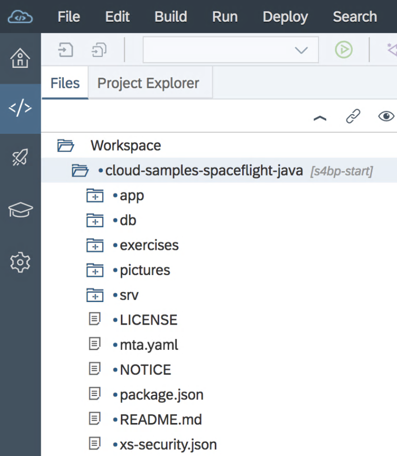

6. xxxx

7. xxxx

8. xxxx

9. xxxx

10. xxxx

11. xxxx
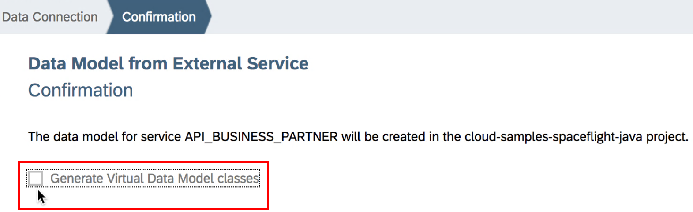

12. xxxx

## 2. Change model

1. Remove comments in `db/index.cds`

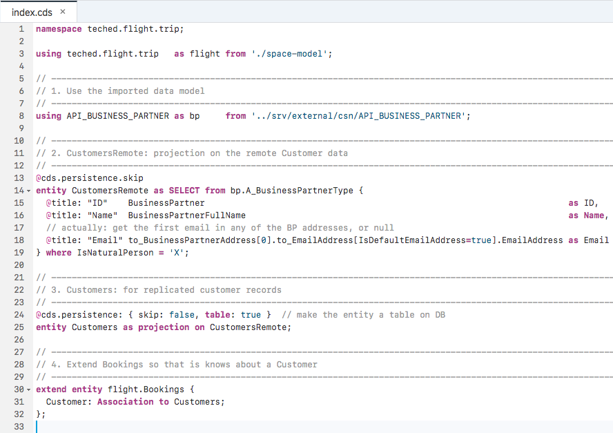

2. Remove comments in `srv/booking-service.cds`

3. Deploy to the database

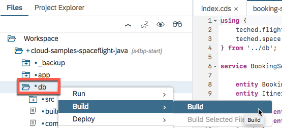
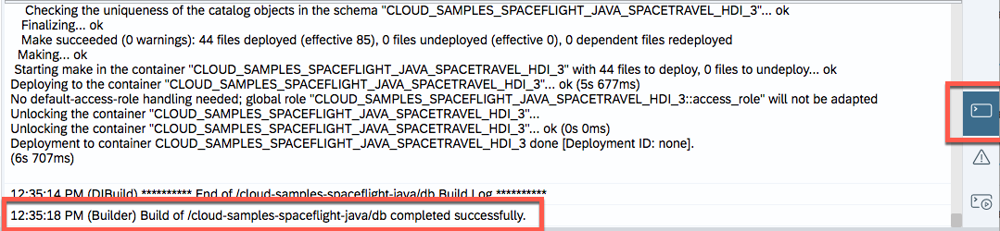

4. Browse the database

## 3. Change custom code: add S/4 calls

1. Adjust `CustomersRemoteHandler`

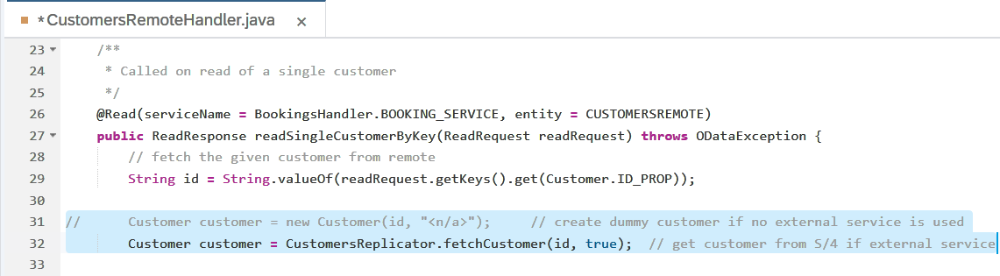
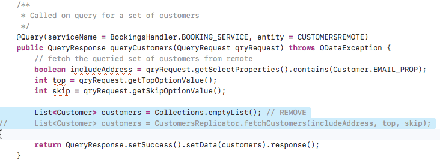

2. Run

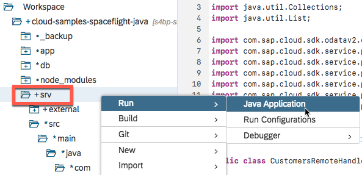
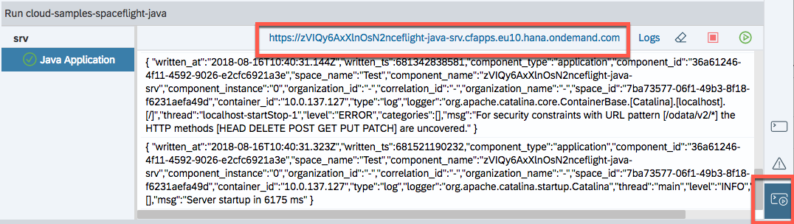

3. Browse

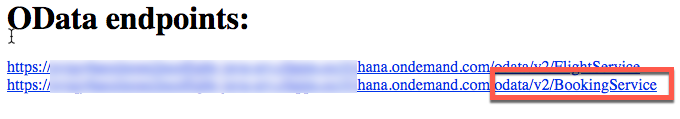
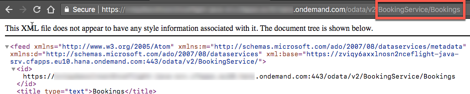

## 4. Show business partner
1. Adjust `BookingsHandler`

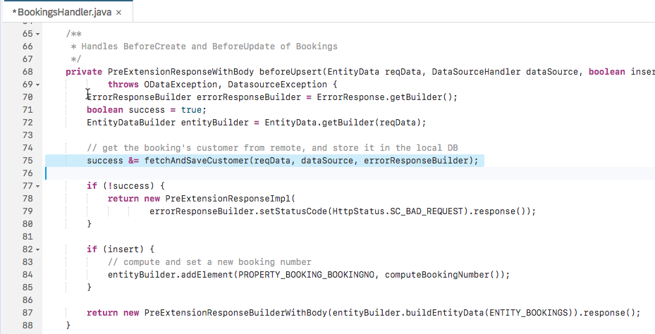
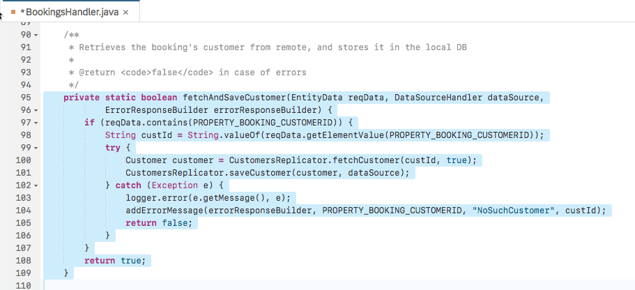

5. Run again

6. Adjust UI

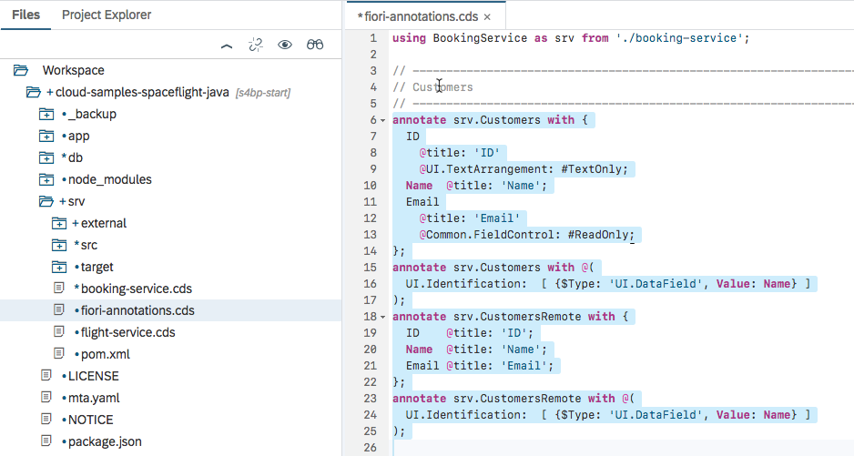
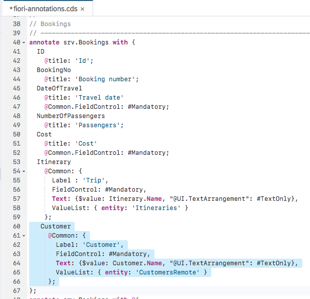

7. Run UI

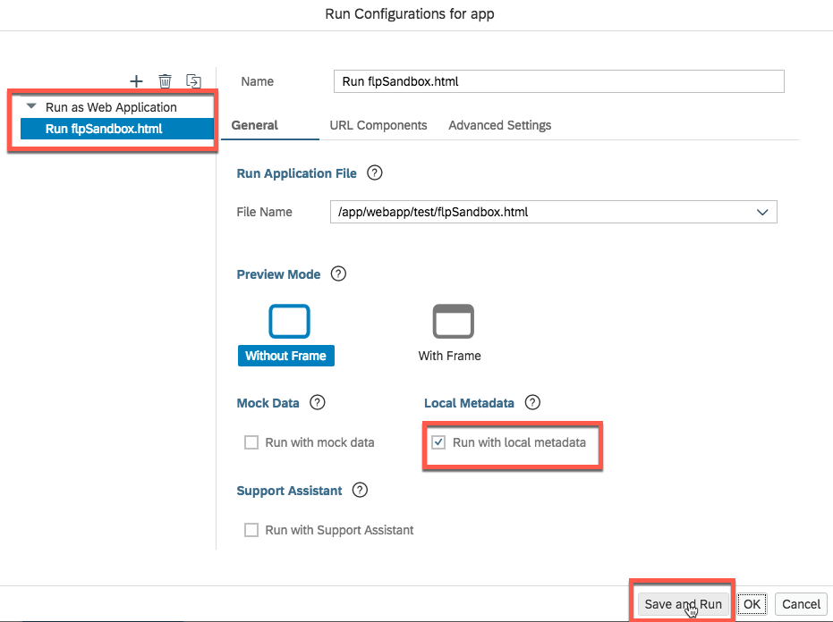

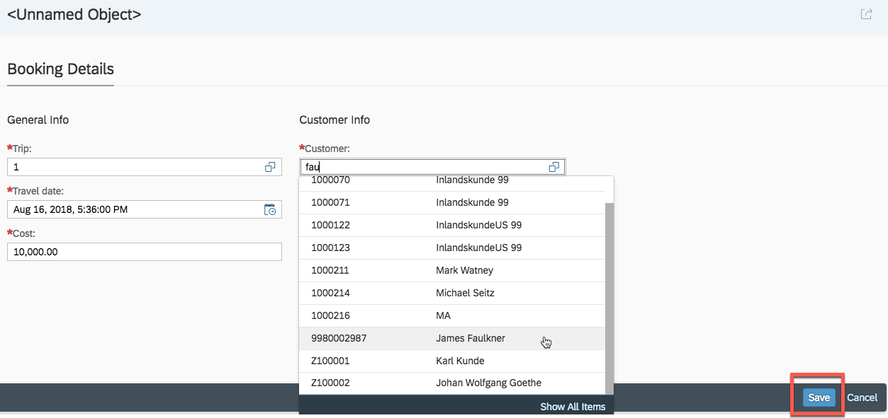
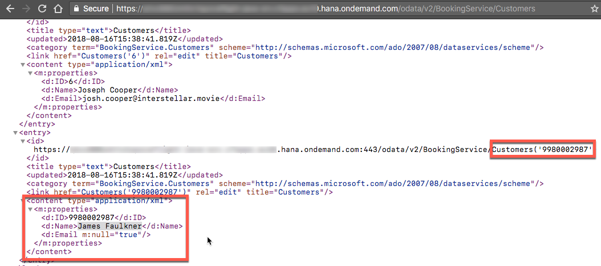

