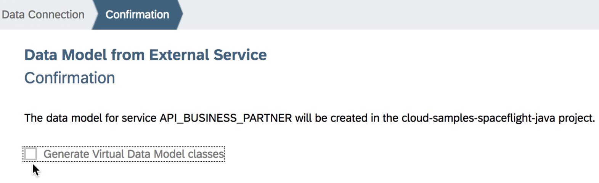

# Exercise 03: Connect an S/4HANA business service (business partner)

## Estimated time

25 minutes

## Objective

In this exercise you'll learn how to ....

# Exercise description

## 1. Import S/4 HANA service

1. For this exercise you have to switch to another code branch of the code you've cloned from Github. Click on the symbol on the right of the browser and click on `Pull` and after that on the `Fetch` symbol.

2. Once this has worked, you should see an information at the top right saying `Pull completed.` and `Fetch completed`

3. Not sure what we have done here before TBD TBD TBD

4. xxxx

5. xxxx

6. xxxx

7. xxxx

8. xxxx

9. xxxx

10. xxxx

11. xxxx

12. xxxx

13. xxxx

14. xxxx

## 2. Change model: add Bookings.Customer

## 3. Change custom code: add S/4 calls

## 4. Adjust UI to show business partner