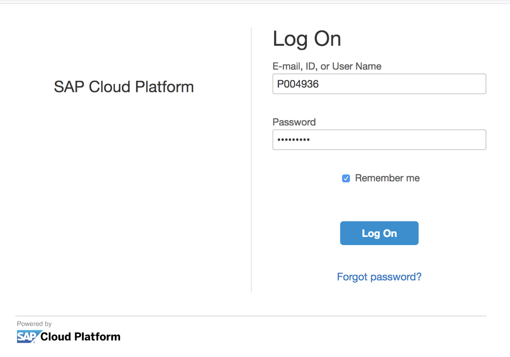
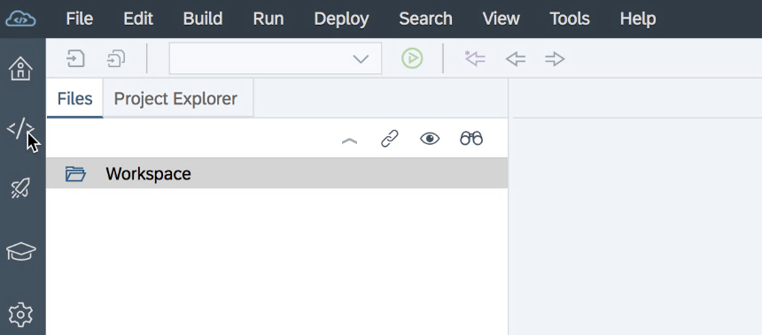
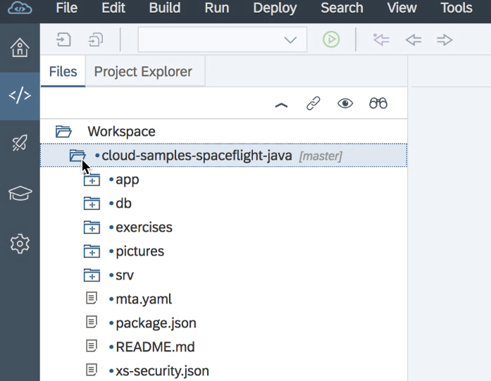

# Exercise 01: Accessing the SAP Cloud Platform Account and Cloning Sample From Github

##Estimated time

10 minutes

##Objective

In this exercise you'll learn how to clone the Git repository that contains the sample project of this tutorial.

#Exercise description

Login with user id on WebIDE directly!

