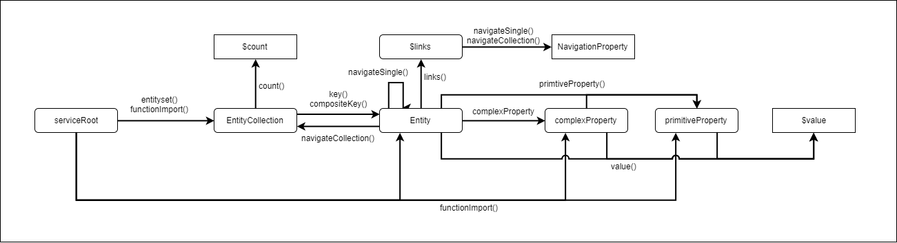

# Uri Builder

The uri builder allows you to build request uris using a "fluent api" that are conform with the OData V2 and V4 standard.
The uri builder
* guides you through the building process with (typed) apis...
* ... to only create OData ABNF conform uris
* automatically encodes parameter values based on the model information
* checks your input (e.g. entityset-, property- or parameter-names) against the model
* provides 
  

## Usage

* Require the dependency and load your edm
```javascript
const UriBuilder = require('./client/index').UriBuilder;
const edmJson = require('./path/to/model.json');
```
* Instantiate the builder with the edm
```javascript
const uriBuilder = new UriBuilder(edmJson);
```

## Build OData V2 URIs

The following examples show, how you can utilize the uri builder to build different kind of OData V2 uris.

* $metadata:
```javascript
uriBuilder.v2(edmJson).metadata();
```
* EntitySet:
```javascript
uriBuilder.v2(edmJson).entitySet('EntitySetName');
```
* EnitySet(simpleKey)
```javascript
uriBuilder.v2().entitySet('EntitySetName').key(keyValue);
```
* EnitySet(keyProperty1=value1,keyProperty2=value2):
```javascript
uriBuilder.v2().entitySet('EntitySetName')
    .compositeKey('keyName', keyValue).compositeKey('keyName', keyValue);
```
* Entityset(key)/navigation:
```javascript
// navigationToMany
uriBuilder.v2().entitySet('EntitySetName').key(keyValue)
    .navigateCollection('navigationPropertyName');
// navigationToOne
uriBuilder.v2().entitySet('EntitySetName').key(keyValue)
    .navigateSingle('navigationPropertyName');
```
* Entityset(key)/property:
```javascript
// primitiveProperty
uriBuilder.v2().entitySet('EntitySetName').key(keyValue)
    .primitiveProperty('propertyName');
// complexProperty
uriBuilder.v2().entitySet('EntitySetName').key(keyValue)
    .complexProperty('propertyName');
// complexProperty + primitive
uriBuilder.v2().entitySet('EntitySetName').key(keyValue)
    .complexProperty('propertyName')
    .primitiveProperty('propertyName');
```
* $count
```javascript
// EntitySet/$count
uriBuilder.v2(edmJson).entitySet('EntitySetName').count();
// NavigationMany/$count
uriBuilder.v2().entitySet('EntitySetName').key(keyValue)
    .navigateCollection('navigationPropertyName').count();
```
* $value
```javascript
// entity/$value
uriBuilder.v2().entitySet('EntitySetName').key(keyValue).value();
// primitiveProperty/$value
uriBuilder.v2().entitySet('EntitySetName').key(keyValue)
    .primitiveProperty('propertyName').value();
// complexProperty/$value
uriBuilder.v2().entitySet('EntitySetName').key(keyValue)
    .complexProperty('propertyName').value();
```
* FunctionImport with parameters
```javascript
uriBuilder.v2().functionImport('FunctionImportName')
    .parameter('parameterName', parameterValue).parameter('parameterName', paramaterValue)
```

## Add Query Options

You can also add OData system query options as well as custom query options to an uri.

* custom:
    ```javascript
    uriBuilder.v2().entitySet('EntitySetName').query('name', 'value');
    ```
* $top:
    ```javascript
    uriBuilder.v2().entitySet('EntitySetName').top(1);
    ```
* $skip:
    ```javascript
    uriBuilder.v2().entitySet('EntitySetName').skip(1);
    ```
* $inlinecount:
    * for v2 `.inlineCount()` or `.inlineCount(true)` results in `$inlinecount=allpages`
    * for v2 `.inlineCount(false)` results in `$inlinecount=none`
    ```javascript
    uriBuilder.v2().entitySet('EntitySetName').inlineCount();
    ```
* $expand:
    ```javascript
    uriBuilder.v2().entitySet('EntitySetName').expand('NavigationPropertyName')
    ```
* $format:
    ```javascript
    uriBuilder.v2().entitySet('EntitySetName').format('formatName')
    ```
* $filter:
    ```javascript
    uriBuilder.v2().entitySet('EntitySetName').filter("'PropertyName eq 'value'")
    ```
* $select:
    * selecting multiple properties can be achieved by calling `.select()` multiple times
    ```javascript
    uriBuilder.v2().entitySet('EntitySetName').select('Property1').select('AnotherProperty')
    ```
* $orderby:
    * ordering with more than one expression can be achieved by callind `.orderby()` multiple times
    ```javascript
    uriBuilder.v2().entitySet('EntitySetName').orderby('Property1', 'asc').orderby('AnotherProperty', 'desc')
    ```
    
Query Options can also be combined by just chaining the different method calls:
```javascript
uriBuilder.entitySet('EntitySetName').orderby('Property1').select('Property1').top(2).skip(5);
```

## Get the Url string

```javascript
const exampleBuilder = uriBuilder.v2().entitySet().key();
const uri = exampleBuilder.getUrl();
```

## State Machine Diagram of the OData V2 Uri Builder

As the examples above are just an extract of what is possible, the following diagram shows all kind of 
'paths' that can be taken by using the uri builders methods.  


